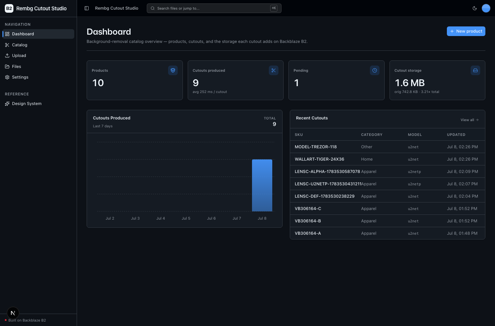
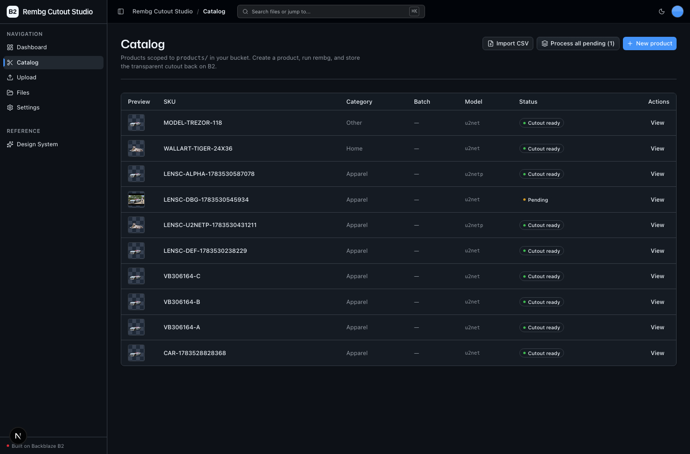
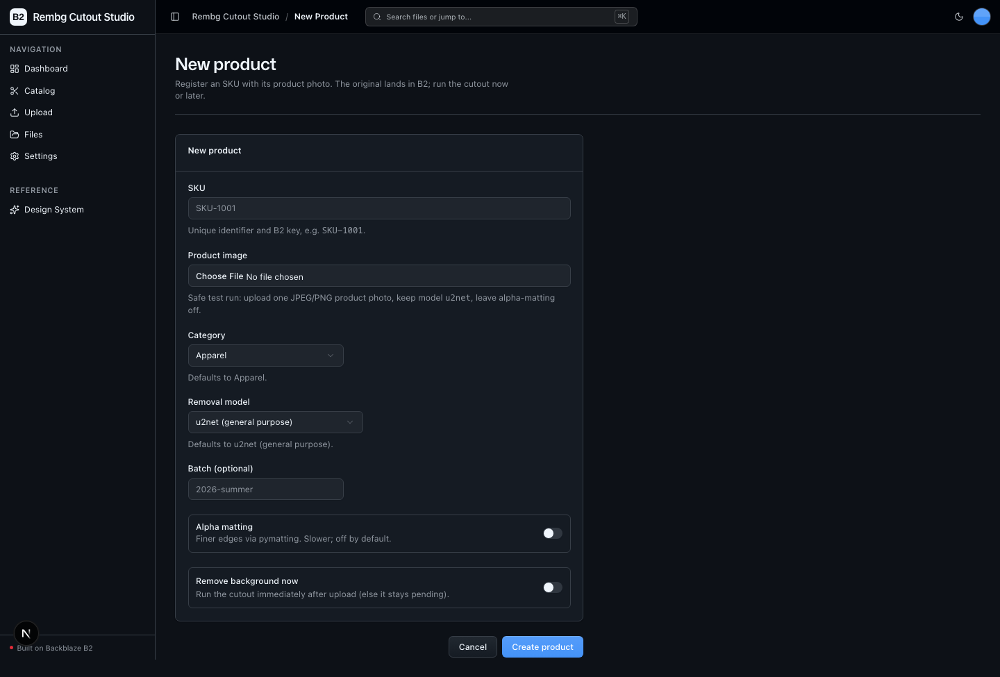
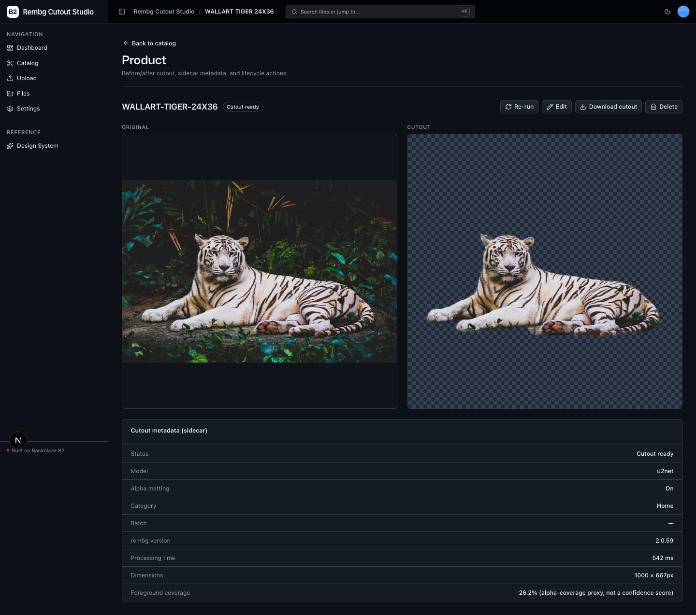

<!-- last_verified: 2026-07-08 -->
# Rembg Cutout Studio

Batch **product-image background removal** for e-commerce catalogs, print-on-demand
platforms, and marketplace sellers. Original product photos land in
**[Backblaze B2](https://www.backblaze.com/cloud-storage?utm_source=github&utm_medium=referral&utm_campaign=ai_artifacts&utm_content=b2ai-rembg-cutouts)**;
the app runs the open-source [**rembg**](https://github.com/danielgatis/rembg) (U²-Net family)
library **locally** — no paid API, no second key — to produce a matched transparent-PNG
cutout per image, writing the cutout plus a metadata sidecar back to B2. Every original
generates a comparably-sized cutout, so stored volume roughly doubles as SKUs are onboarded —
this sample makes that write-amplification visible on the dashboard.

B2 is both the ingest landing zone and the durable system of record: originals, cutouts,
sidecars, and a per-SKU catalog manifest all live as B2 objects, browsable from the app.
There is **no database** — object layout + per-SKU catalog JSON *is* the state.

## What it looks like

**Dashboard** — catalog metrics (products, cutouts produced, pending, cutout-vs-original storage with an amplification ratio), a 7-day cutouts-produced chart, and recent cutouts.



**Catalog** — the `products/` explorer: every SKU with a transparent-cutout thumbnail, category, model, and status, plus batch CSV import and "Process all pending".



**New product** — register an SKU with its photo, pick a U²-Net model, and optionally run the cutout immediately on upload.



**Product detail** — before/after (original vs. transparent-PNG cutout over a transparency checkerboard) with the sidecar metadata: model, rembg version, processing time, dimensions, and foreground-coverage proxy.



## Workflow

```
ingest → remove → store → serve
```

1. **Ingest** — create a product (SKU + photo) or batch-import a CSV manifest with many
   images. The original uploads to `products/originals/<sku>/…` on B2.
2. **Remove** — run rembg on one product ("Remove background") or every pending product
   ("Process all pending"). Runs locally on CPU (GPU auto-detected if present).
3. **Store** — the transparent-PNG cutout and a JSON sidecar are written back to B2 under
   `products/cutouts/<sku>/…`; the per-SKU catalog manifest is updated.
4. **Serve** — the detail page shows the before/after (original vs. cutout over a
   transparency checkerboard) with presigned URLs; download the cutout with one click.

## Features

- **Background removal (rembg / U²-Net)** — model selector (`u2net`, `u2netp`,
  `isnet-general-use`, `u2net_human_seg`, `silueta`) + optional alpha-matting. Local, $0,
  no API key. See [docs/features/background-removal.md](docs/features/background-removal.md).
- **Product catalog CRUD** — the primary entity: create / read / edit / delete / run, all
  from the UI. See [docs/features/product-catalog.md](docs/features/product-catalog.md).
- **Batch ingest via CSV manifest** — upload `sku,category,batch,filename` plus images to
  register thousands of SKUs at once. See [docs/features/batch-ingest.md](docs/features/batch-ingest.md).
- **Batch background removal** — "Process all pending" runs rembg across every pending
  product, demonstrating continuous write amplification.
- **Before/after preview + sidecar metadata** — model, rembg version, processing ms,
  dimensions, foreground-coverage proxy, alpha-matting.
- **Domain dashboard** — Products, Cutouts produced, Pending, cutout storage vs. originals
  with an amplification ratio, cutouts-per-day chart, and recent cutouts.
- **Bucket explorer** ([`/files`](docs/features/file-browser.md)) and generic
  [Upload](docs/features/file-upload.md) — the reusable B2 scaffolding, kept as-is.

## B2 object layout (the durable "database")

```
products/originals/<sku>/<filename>        original product image
products/cutouts/<sku>/<stem>.png          transparent cutout
products/cutouts/<sku>/<stem>.json         sidecar { model, rembg_version, processing_ms,
                                             width, height, foreground_ratio, alpha_matting,
                                             created_at }
products/catalog/<sku>.json                per-SKU manifest (editable metadata + status)
```

`foreground_ratio` is the fraction of pixels whose alpha is above threshold — an honest
**coverage proxy**, not a model confidence score (rembg emits none; we do not fabricate one).

## Quick Start

You need: Node.js >= 20.9.0, pnpm >= 9, Python >= 3.11, and a free
**[Backblaze B2 account](https://www.backblaze.com/cloud-storage?utm_source=github&utm_medium=referral&utm_campaign=ai_artifacts&utm_content=b2ai-rembg-cutouts)**.

**1. Install frontend dependencies**

```bash
pnpm install
```

**2. Set up the backend (two-step install)**

The core API installs fast and green **without** the heavy ML stack. Install the rembg
engine separately:

```bash
cd services/api
python -m venv .venv && source .venv/bin/activate
pip install -r requirements.txt        # core API (no rembg)
pip install -r requirements-ml.txt     # rembg + onnxruntime engine
cd ../..
```

> **First-run model download:** the first cutout downloads the selected U²-Net model
> (~176 MB for `u2net`) from GitHub to `~/.u2net/`. Network is required on first use only.
> A green `pnpm test:api` does **not** prove the engine works — the tests mock rembg. Only an
> actual end-to-end run confirms rembg produces a cutout on a fresh clone.

**3. Add your B2 credentials**

```bash
cp .env.example .env
```

Open `.env` and fill in (from the
[B2 dashboard](https://secure.backblaze.com/b2_buckets.htm?utm_source=github&utm_medium=referral&utm_campaign=ai_artifacts&utm_content=b2ai-rembg-cutouts)):

| Variable | Where it comes from |
|----------|---------------------|
| `B2_APPLICATION_KEY_ID` | Application key **keyID** (`Read and Write`) |
| `B2_APPLICATION_KEY` | Application **applicationKey** *(shown once)* |
| `B2_BUCKET_NAME` | Bucket **Unique Name** |
| `B2_REGION` | Bucket region, e.g. `us-west-004` — the S3 endpoint is derived as `https://s3.<region>.backblazeb2.com` |
| `B2_PUBLIC_URL_BASE` | *Optional* — a public/CDN base URL. Presigned URLs work without it. |

**4. Run it**

```bash
pnpm dev
```

Frontend at `localhost:3000`, API at `localhost:8000`. Create a product, upload a JPEG/PNG,
keep model `u2net`, and run the cutout. `pnpm dev` runs `pnpm doctor` first — a preflight
check for the common setup gotchas.

## GPU / CPU

Background removal is `deployment: local`. **CPU is the default; a GPU is auto-detected and
never required.** At runtime the app picks onnxruntime execution providers: `CUDA` if
available, otherwise `CPU`. Apple CoreML/MPS is flaky for U²-Net and is **opt-in only** via
`REMBG_PROVIDERS` (e.g. `REMBG_PROVIDERS=CoreMLExecutionProvider,CPUExecutionProvider`).

## Commands

| Command | What it does |
|---------|-------------|
| `pnpm dev` | Start frontend + backend |
| `pnpm dev:web` | Frontend only |
| `pnpm dev:api` | Backend only |
| `pnpm build` | Build frontend |
| `pnpm lint` | Lint frontend |
| `pnpm lint:api` | Lint backend (ruff) |
| `pnpm test:api` | Run backend tests (rembg mocked — see note above) |
| `pnpm check:structure` | Verify layering rules |
| `pnpm test:e2e` | Playwright e2e tests (run `pnpm --filter @rembg-product-background-removal/web exec playwright install chromium` once first) |

## Tech Stack

- TypeScript, Next.js 16, React 19, Tailwind v4, shadcn/ui, Recharts, TanStack Query
- Python 3.11+, FastAPI, boto3, Pydantic v2, Pillow
- **rembg** (U²-Net family) + onnxruntime — local, keyless background removal
- Backblaze B2 (S3-compatible object storage) as ingest zone + system of record
- pnpm workspaces (monorepo)

## Documentation Map

| Doc | Purpose |
|-----|---------|
| [AGENTS.md](AGENTS.md) | Agent table of contents — start here |
| [ARCHITECTURE.md](ARCHITECTURE.md) | System layout, layering, data flows |
| [docs/features/](docs/features/) | Feature docs (background removal, catalog, batch ingest, upload, browser, dashboard, metadata) |
| [docs/design-system.md](docs/design-system.md) | Design tokens, primitives, loader, error/empty states |
| [docs/app-workflows.md](docs/app-workflows.md) | User journeys |
| [docs/dev-workflows.md](docs/dev-workflows.md) | Engineering workflows and testing |
| [docs/SECURITY.md](docs/SECURITY.md) | Security principles |
| [docs/RELIABILITY.md](docs/RELIABILITY.md) | Reliability expectations |
| [docs/exec-plans/](docs/exec-plans/) | Execution plans and tech debt tracker |

## License

MIT License - see [LICENSE](LICENSE) for details.

## Claude Agent B2 Skill

Manage Backblaze B2 from your terminal using natural language (list/search, audits, stale or
large file detection, security checks, safe cleanup).

Repo: [https://github.com/backblaze-b2-samples/claude-skill-b2-cloud-storage](https://github.com/backblaze-b2-samples/claude-skill-b2-cloud-storage)
